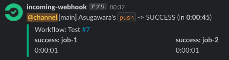

# What is GithubAction2Slack?
GithubAction2Slack is Action to post GithubActions Workflow status into Slack channel via webhook URL on Python3.
It's convenient for python users to know Workflow status quickly and expand this easily.


# Inputs
| INPUT | REQUIRED | Description |
| ----- | -------- | ----------- |
| GITHUB_TOKEN | True | GitHub provides a token that you can use to authenticate on behalf of GitHub Actions. Please check [ofiicial docs!](https://docs.github.com/en/actions/security-guides/automatic-token-authentication)|
| SLACK_WEBHOOK_URL | True | Webhook URL integration must be created within your [slack app](https://caadtech.slack.com/apps/A0F7XDUAZ--incoming-webhook-). |
| MENTION_MAP | False | Key: "branch name", "GitHub user id"<br />Value: "slack user id", "<!channel>", "<!here>" (If you want to add a condition in workflow status you can set a new object(dict) with workflow status as a key) |
| STATUS_EMOJI_MAP | False | Key: "workflow status"<br />Value: "icon_emoji" |
| NAME | False | BOT name (default "BOT")|


# Workflow Example
```yaml
name: Test
on: push
jobs:
  job-1:
    runs-on: ubuntu-latest
    steps:
      - name: test-1
        run: echo "Hello"
  job-2:
    runs-on: ubuntu-latest
    steps:
      - name: test-2
        run: exit 1

  test-action:
    if: always()
    name: GithubAction2Slack-Test
    runs-on: ubuntu-latest
    needs:
      - job-1
      - job-2
    steps:
      - name: slack test
        uses: Asugawara/GithubAction2Slack@main
        with:
          GITHUB_TOKEN: "${{secrets.GITHUB_TOKEN}}"
          SLACK_WEBHOOK_URL: ${{secrets.SLACK_WEBHOOK_URL}}
          MENTION_MAP: '{"Asugawara": {"FAILURE": "${{secrets.SLACK_USER_ID}}"} , "main": "<!channel>"}'
          STATUS_EMOJI_MAP: '{"SUCCESS": ":circleci-pass:", "FAILURE": ":circleci-fail:"}'

```


# Versioning
GithubAction2Slack use [Semantic Versioning](https://semver.org/).

# License
GithubAction2Slack is released under the MIT License. See [LICENSE](/LICENSE) for additional details.
